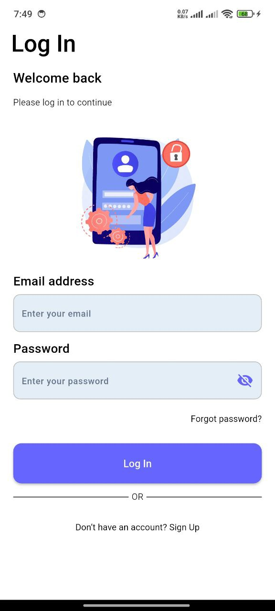
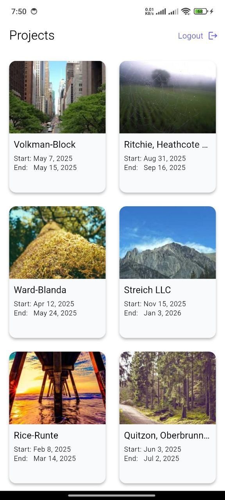
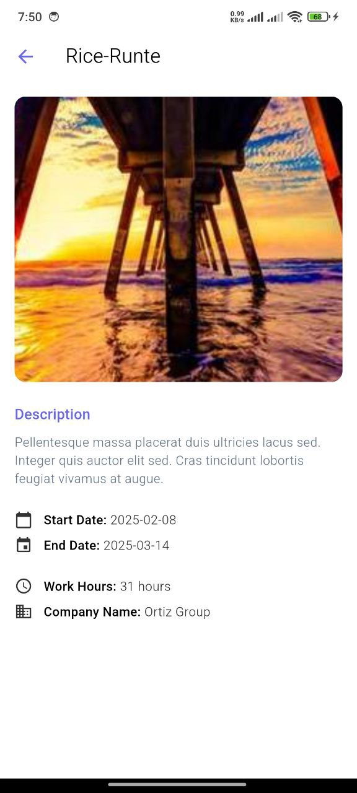

# 📱 ISS Test App

A simple Flutter app that showcases company projects with clean navigation across Splash, Login, Home, and Detail screens. Built with organized code and intuitive UI to highlight Flutter best practices.

---

## 🎯 Features

- ✅ **Clean Architecture**: Scalable and testable codebase with clear separation of concerns.
- 🧠 **Bloc State Management**: Efficient handling of UI and business logic.
- 📱 **Responsive Design**: Adapts to various screen sizes using `flutter_screenutil`.
- 🌓 **Dark Mode Support**: Provides a user-friendly experience in low-light environments.
- 🔌 **Dependency Injection**: Uses `get_it` to manage and inject service instances cleanly.
- 🧪 **Error Handling**: Catches and displays meaningful errors for network and input issues.
- ♿ **Accessibility**: Designed with accessibility in mind for an inclusive user experience.
- 🚀 **Performance Optimization**: Lazy loading and Bloc ensure responsive, fast UI updates.
- 🔧 **Code Quality**: Follows Dart & Flutter best practices with clean, maintainable code.
- 🛠️ **Code Formatting**: Consistently formatted using `dart format`.

## 📝 Notes
This app is built using Clean Architecture and is designed to be scalable and maintainable.

The codebase is written in a way that supports expansion for larger applications, making it easy to:

- Add new features
- Maintain separation of concerns
- Reuse components

Ideal for real-world production use and team collaboration in modular environments.

## 📸 Screenshots

|Splash Screen | Login Screen |
|---------------|--------------|
|  |  |

| Home Screen | Project Details |
|-------------|-----------------|
|  |  |

---

## 🎥 Demo Video

[📽️ Watch App Demo](https://drive.google.com/file/d/14XFISM6tKnoutAeS3vZuLmyNUA2CF2u8/view?usp=drive_link)

---

## 📦 APK Download After Fix Responsive Issue

[⬇️ Download APK](https://drive.google.com/file/d/1R7GRYm-yX9TZ416Zktf75YYe1E92r7Ke/view?usp=drivesdk)  
**Filename**: `WoroudMahmoud_TestApp.apk`

---

## 🚀 Getting Started

1. Install [Flutter SDK](https://flutter.dev/docs/get-started/install)
2. Clone the repository and navigate to the project directory.
3. Run the following commands:

flutter pub get
flutter run
